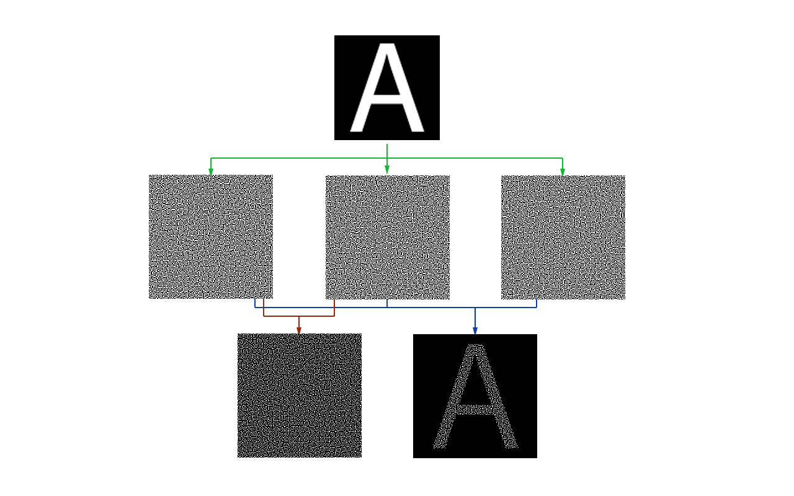

# Loki



## Visual Cryptography
Visual cryptography is a cryptographic technique which allows visual information (pictures, text, etc.) to be encrypted in such a way that the decrypted information appears as a visual image. 

## Usage
This program allows the user to generate n shares of an image, and only by overlapping all n shares the initial image can be seen.
To create an 5-5 scheme on an input.png image with a custom expansion of 16 subpixels arranged in 4x4 quads simply use this:

```
python loki.py input.png 5 --subpixels 16 --stride 4
```

The default pixel expansion is the lowest possible, *2 ^ (n - 1)*, and the stride used to rearange the subpixels in a quad is *isqrt(expansion factor)*
Use --help for the other settings.
